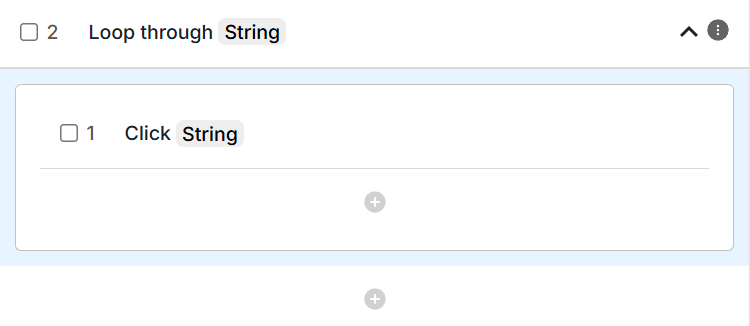
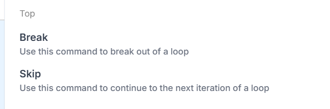
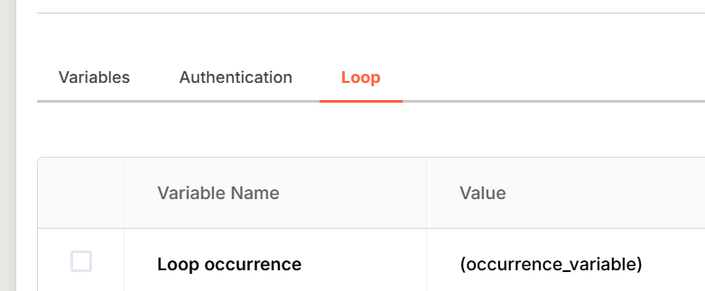
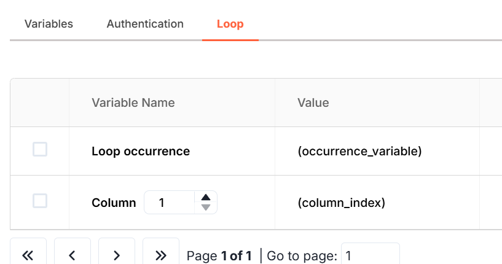

# Loop

The **Loop** command repeats one or more steps multiple times. It supports three modes:

| Mode | Iterates over | Typical use |
| --- | --- | --- |
| **For each field** | Page elements (rows, buttons, etc.) | An unknown number of fields |
| **For a range** | A number range | Repeat N times |
| **For Excel / CSV** | Spreadsheet rows | Data-driven input |

## For each field

Loops through every occurrence of a specific field and performs the actions inside the loop for each one.

It's most often used with **tables**. For example, entering a value into each row when the number of rows is unknown.

1. **Select the target field**: for example, a row or column.
2. **Set a maximum limit**: for example `3` rows, so the loop cannot run forever.
3. Add your **steps** inside the loop. They'll be executed once per matching field.

### Inherit field behaviour

When looping through fields you can use the **Inherit field** option. This automatically applies each action (a click or a type) to the current field in the loop.

For example, adding a Click action inside the loop clicks that iteration's field by default. To override this, click the **wand icon** and select a different field.

### Skip and break

You can control the loop flow with:

- **Skip**: move to the next iteration
- **Break**: stop the loop entirely

These are commonly used with conditionals, for example *"skip if field is empty"*.

## For range

Runs the loop a fixed number of times instead of looping through fields.

1. Define the **start** and **end** of the range. For example, `1 to 5`.
2. Inside the loop a **loop variable** is created automatically, so you can reference the current iteration.

**Example**: repeat a form submission 5 times with different data each run.

## For Excel / CSV

Enables **data-driven testing** by looping through each row of a spreadsheet.

1. Provide a **CSV or Excel file** via a variable.
2. The loop runs once per line in the file.
3. Access the data in each column using the built-in **column variable**.

**Example**: if your file contains `Name, Email, Role`, the loop can automatically fill these into matching form fields for every row in your dataset.
