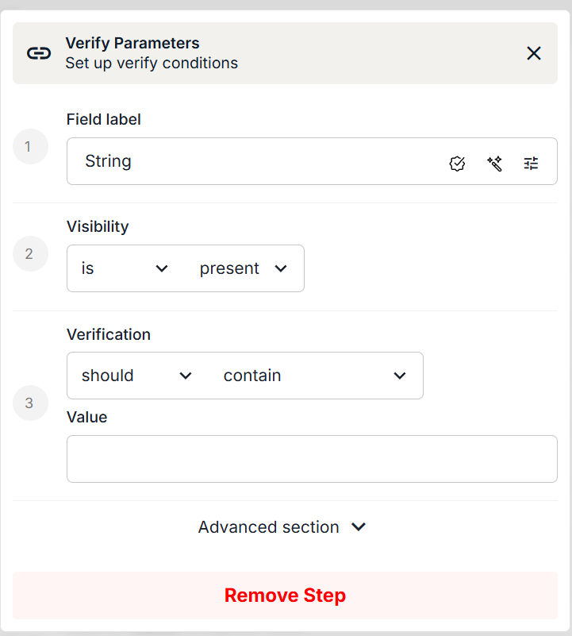

# Verification

## Verify

**Purpose** — verify something on the page.

### Verify types

| # | Type | Checks |
| --- | --- | --- |
| 1 | **Present** | A field is present on the page |
| 2 | **Not Present** | A field is not present on the page |
| 3 | **(Un)Checked** | A checkbox is in a specific state |
| 4 | **Disabled** | A field is disabled |
| 5 | **Enabled** | A field is enabled |
| 6 | **Editable** | A field is editable |
| 7 | **Contains** | A text field contains text (does not work for inputs) |
| 8 | **Value** | An input field contains a value (does not work for non-input fields) |
| 9 | **Option** | A field has a specific option — goes off [standard HTML select values](https://www.w3schools.com/tags/tag_option.asp) |
| 10 | **Empty** | An input field is empty |
| 11 | **Focused** | A field is in focus |
| 12 | **Viewport** | A field is inside the [viewport](https://www.w3schools.com/css/css_rwd_viewport.asp) |
| 13 | **Accessible Description** | A field has a specific [accessible description](https://developer.mozilla.org/en-US/docs/Glossary/Accessible_description) |
| 14 | **Accessible Name** | A field has a specific [accessible name](https://developer.mozilla.org/en-US/docs/Glossary/Accessible_name) |
| 15 | **DOM Attribute** | A field has a specific DOM attribute |
| 16 | **Class** | A field has a specific class |
| 17 | **Children Count** | A field has a specific count of child elements |
| 18 | **CSS Property** | A field has a specific CSS property — for example `display,none` |
| 19 | **ID** | A field has a specific ID |
| 20 | **Javascript Property** | A field has a specific JS property |
| 21 | **ARIA Role** | A field has a specific [ARIA role](https://developer.mozilla.org/en-US/docs/Web/Accessibility/ARIA/Reference/Roles) |
| 22 | **Text** | A non-input field has the exact text |
| 23 | **Title** | The page has a specific title |
| 24 | **URL** | The page has a specific URL |

### Advanced

| Option | Effect |
| --- | --- |
| **Expect failure** | Negates the result of the verification |
| **Error Message** | A custom error message shown when the verification fails |
| **Timeout** | The maximum time the test waits for the verification before failing |

---

## Verify Field

The **Verify Field** command checks one or more properties of a field and validates its value or state. It's typically used to confirm a field is visible, enabled, contains expected text, or matches specific conditions.

### Field setup

Start by selecting the **field** you want to verify. You can then configure a series of checks — beginning with visibility, followed by content or value validation.

### Visibility conditions

The first check determines the **visibility or state** of the field. You can verify whether the field **is** or **is not**:

| Condition | Meaning |
| --- | --- |
| **present** | The field exists in the DOM |
| **visible** | The field is currently shown on the page |
| **enabled** | The field is active and can be interacted with |
| **checked** | Applicable to checkboxes and toggles |
| **editable** | The field allows text entry |
| **selected** | Applies to dropdowns and options |

This confirms the field's presence and availability before continuing with further validations.

### Verification conditions

After the visibility check you can add a value or content verification. Use the **Verification** dropdown to select:

- **should** — the field is expected to match the condition
- **should not** — the field is expected *not* to match the condition
- **none** — skip content verification and use only the visibility check

Then choose what to verify:

| Condition | Passes when |
| --- | --- |
| **empty** | The field has no value |
| **contain** | The field includes a specific substring |
| **equal** | The field exactly matches the expected value |
| **start with** | The value starts with the given text |
| **end with** | The value ends with the given text |
| **be less than** | The numeric value is smaller than expected |
| **be less than or equal** | The numeric value is smaller or equal |
| **be greater than** | The numeric value is larger than expected |
| **be greater than or equal** | The numeric value is larger or equal |
| **match regex** | The value matches a regular expression |

### Expected value

Finally, enter the **value** you expect the field to meet for the selected condition. This can be a fixed string or a variable.

**Example**

| Step | Setting |
| --- | --- |
| Verification | `should` |
| Condition | `contain` |
| Value | `Pending` |

The test passes only if the field's text contains the word *Pending*.

!!! tip
    Combine Verify Field with conditional logic to build validation steps that only proceed when UI conditions are met.
