# Azure DevOps pipelines

Run elevaite365 scenarios from an Azure DevOps pipeline and get the results back as an Azure Test Plan.

The integration is three steps:

1. [Install the elevaite365 Scenario Execution extension](#1-install-the-extension)
2. [Export your scenarios to a YAML file](#2-export-scenarios-to-yaml)
3. [Create a project and pipeline in Azure DevOps](#3-create-a-project-and-pipeline)

!!! info "Two ways to reach elevaite365 from CI/CD"
    This extension is the quickest route for Azure DevOps. If you are on a different CI system, or want more control over the flow, use the [External API](../api/index.md) directly.

## 1. Install the extension

1. Open the [elevaite365 Scenario Execution extension](https://marketplace.visualstudio.com/items?itemName=elevaite365-official.elevaite365-scenario-execution) on the Visual Studio Marketplace.
2. Select **Get it free**.

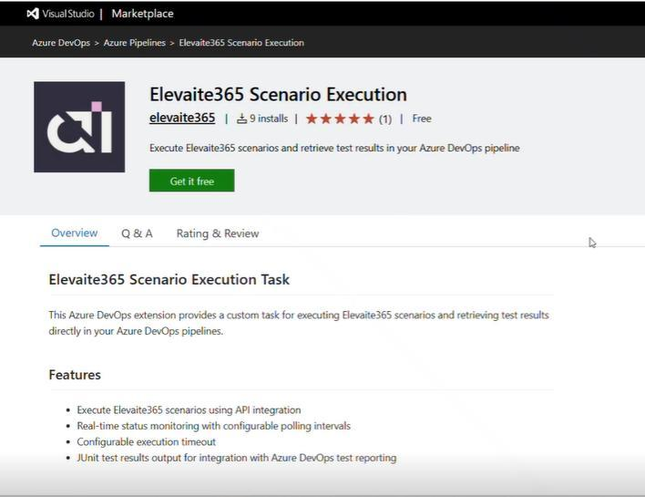

3. Log in using your Microsoft credentials.
4. Select the Azure DevOps organization where the extension will be installed.

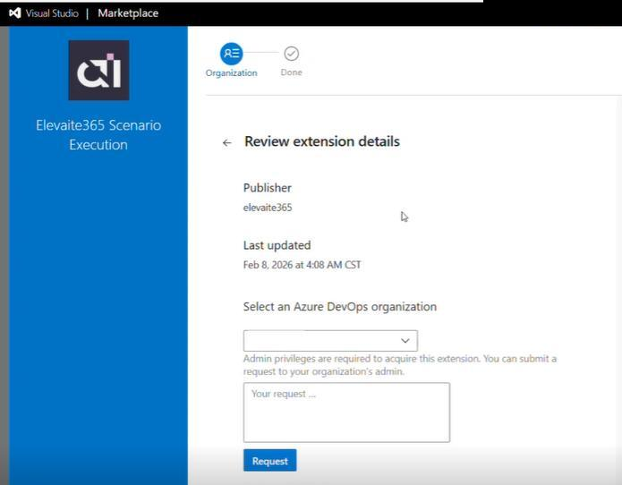

!!! note "Admin privileges"
    Acquiring an extension needs admin rights on the organization. If you do not have them, the same screen lets you submit a request to your organization's admin.

## 2. Export scenarios to YAML

### Create an API key

You need an elevaite365 API key for DevOps. If one already exists, skip to [exporting](#export-the-scenarios).

1. In elevaite365, select your **organization name** in the upper-right corner.
2. Go to **Organization Settings**.

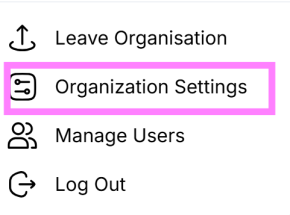

3. If no keys are listed, select **Create New API Key**.

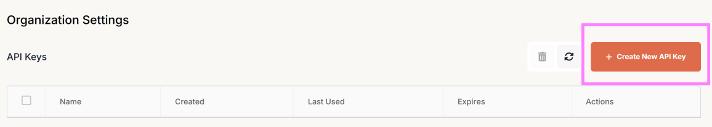

4. Enter a name for the key and click **Create**.

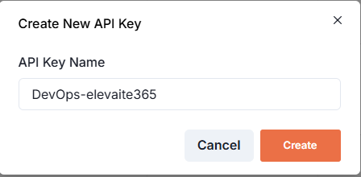

5. Click the **copy** icon to copy the key.

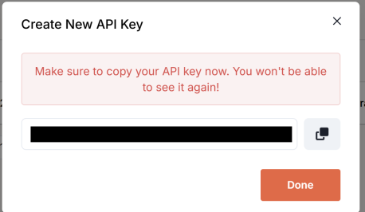

!!! danger "You only see the key once"
    Save it somewhere secure immediately. The key cannot be retrieved again after you close this dialog. If you lose it, create a new one.

6. Click **Done**.

### Export the scenarios

1. From the elevaite365 menu bar, select the **Scenarios** tab.

2. Select the checkboxes next to the scenarios you want to run in DevOps.
3. Click the **three dots** in the upper right and select **Export YAML (Azure)**.

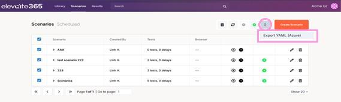

4. Enter a **pipeline name**. This is optional.
5. Select the **API key**.
6. The selected scenarios appear in the dialog. Drag and drop them into the order you want them to execute.
7. Select **Export YAML**.

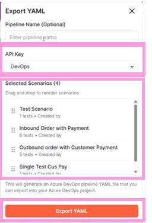

8. Open the downloaded YAML file in a text editor and copy the contents. You will paste this into Azure DevOps.

## 3. Create a project and pipeline

1. Navigate to Azure DevOps.
2. Create a project. Enter a **project name** and click **Create project**.

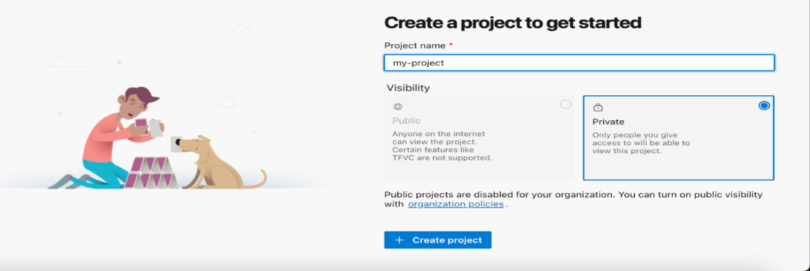

3. From the left sidebar select **Pipelines**, then **Create Pipeline**.

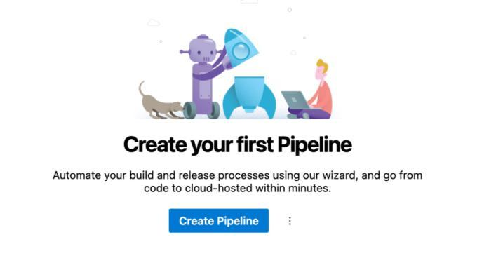

4. Select **Azure Repos Git**.

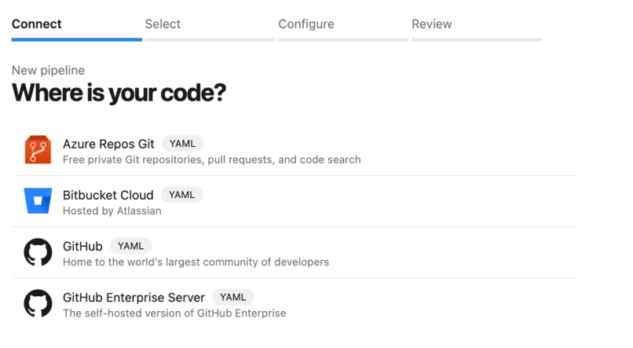

5. Select a repository.

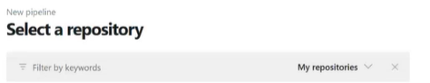

6. Select **Starter pipeline**, or **Existing Azure Pipelines YAML file** if you already have one.

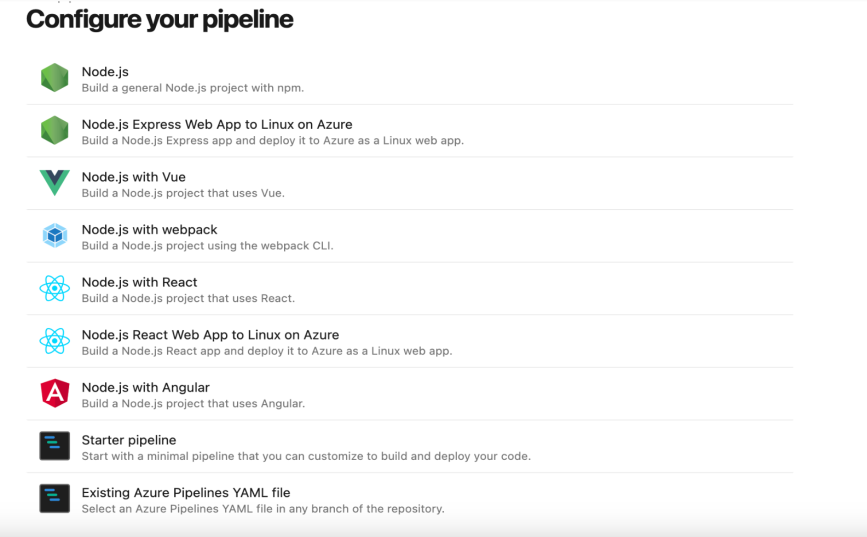

7. Paste the contents of the elevaite365 YAML file, replacing the existing pipeline YAML.

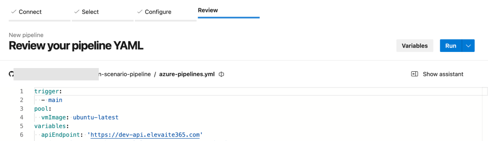

8. **Save**.
9. Select **Run**, and choose how the pipeline should execute, for example on a schedule or from a trigger.

When the pipeline runs, a **Test Plan** is created in Azure DevOps with the results.

## Keeping the pipeline current

!!! warning "Re-export after changing scenarios"
    The YAML is a snapshot. If you update a scenario in elevaite365, or add a new one, export a fresh YAML file and replace the contents of your existing pipeline YAML in Azure DevOps. The pipeline will not pick up the change on its own.

## Related

- [Create scenarios](../quickstart/create-scenarios.md), building the scenarios you export
- [External API](../api/index.md), the underlying API the extension calls
